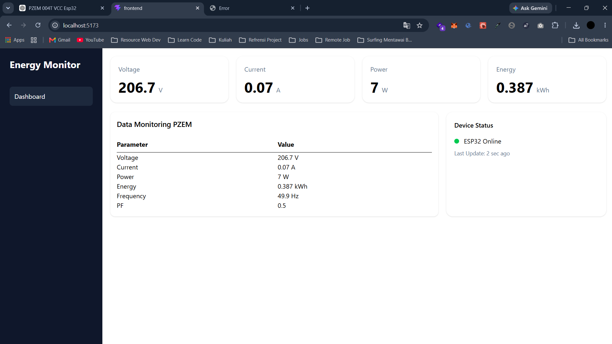

# Power and Current Monitoring Realtime

Sistem monitoring energi listrik secara realtime menggunakan ESP32 dan sensor PZEM-004T. Data tegangan, arus, daya, energi, frekuensi, dan power factor dikirim melalui MQTT, diproses oleh backend Node.js, kemudian ditampilkan pada dashboard web secara realtime.

## Features

- Monitoring tegangan (Voltage) realtime
- Monitoring arus (Current) realtime
- Monitoring daya (Power) realtime
- Monitoring energi (Energy) realtime
- Monitoring frekuensi (Frequency) realtime
- Monitoring Power Factor (PF) realtime
- Integrasi MQTT Broker
- REST API untuk pengambilan data terbaru
- Realtime update menggunakan Socket.IO
- Dashboard responsif untuk desktop dan mobile

---

## Hardware Requirements

### Microcontroller
- ESP32

### Sensor
- PZEM-004T V3.0

### Load Testing
- Lampu AC

### Additional Components
- Kabel jumper
- Kabel listrik
- Power supply ESP32

---

## Software Stack

### Embedded System
- Arduino IDE
- ESP32 Board Package
- PZEM004Tv30 Library
- PubSubClient Library

### Backend
- Node.js
- Express.js
- MQTT.js
- Socket.IO

### Frontend
- React.js
- Vite
- Tailwind CSS
- Axios
- Socket.IO Client

### Source Code ESP32 (voltage-current-monitoring)
- C++
- Library : 
  - PubSubClient.h
  - PZEM004Tv30.h

---

## System Architecture

```text
PZEM-004T
     │
     ▼
   ESP32
     │
 MQTT Publish
     │
     ▼
 MQTT Broker
     │
     ▼
 Node.js Backend
     │
 ┌───┴─────────────┐
 ▼                 ▼
REST API      Socket.IO
 │                 │
 └───────┬─────────┘
         ▼
 React Dashboard
```

---

## MQTT Payload Format

Topic:

```text
pzem/data
```

Payload:

```json
{
    "success": true,
    "data": {
        "telemetry": {
            "voltage": 228.4,
            "current": 0.38,
            "power": 74.6,
            "energy": 0.491,
            "frequency": 49.9,
            "pf": 0.85,
            "updatedAt": "2026-06-17T02:39:56.767Z"
        },
        "device": {
            "online": true,
            "lastUpdate": "2026-06-17T02:39:56.767Z"
        }
    }
}
```

---

## Backend Installation

Clone repository:

```bash
git clone <repository-url>
cd backend
```

Install dependencies:

```bash
npm install
```

Run server:

```bash
npm run dev
```

Server runs on:

```text
http://localhost:3001
```

API Endpoint:

```text
GET /api/pzem/latest
```

Example Response:

```json
{
    "success": true,
    "data": {
        "telemetry": {
            "voltage": 228.4,
            "current": 0.38,
            "power": 74.6,
            "energy": 0.491,
            "frequency": 49.9,
            "pf": 0.85,
            "updatedAt": "2026-06-17T02:39:56.767Z"
        },
        "device": {
            "online": true,
            "lastUpdate": "2026-06-17T02:39:56.767Z"
        }
    }
}
```

---

## Frontend Installation

Move to frontend directory:

```bash
cd frontend
```

Install dependencies:

```bash
npm install
```

Run development server:

```bash
npm run dev -- --host
```

Frontend available at:

```text
http://localhost:5173
```

For access from devices on the same network:

```text
http://<your-local-ip>:5173
```

Example:

```text
http://192.168.1.6:5173
```

---

## Project Structure

```text
project-root
│
├── backend
│   ├── routes
│   ├── controllers
│   ├── services
│   ├── mqtt
│   └── server.js
│
├── frontend
│   ├── src
│   │   ├── Components
│   │   ├── Pages
│   │   ├── hooks
│   │   ├── services
│   │   └── layouts
│   └── vite.config.js
│
└── README.md
```

---

## Dashboard Preview

### Dashboard



---

## Future Improvements

- Historical data storage
- Data visualization with charts
- Daily and monthly reports
- Device management
- User authentication
- Data export (PDF/Excel)
- Notification and alert system

---

## License

This project is intended for educational, research, and IoT monitoring purposes.
