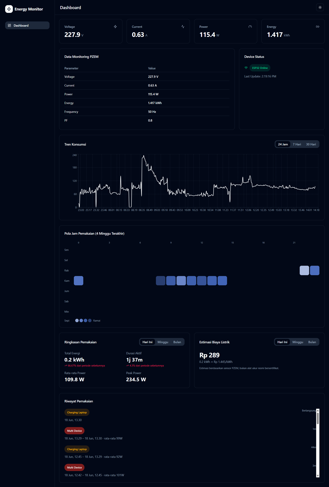
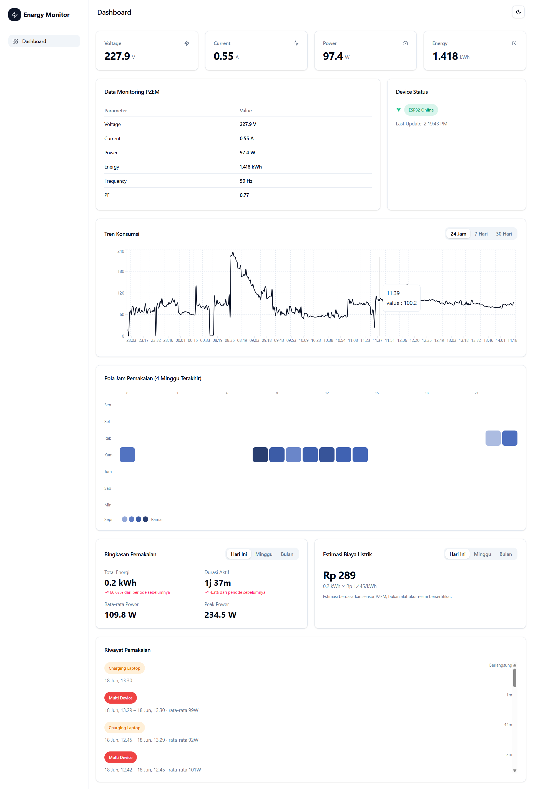

# Power and Current Monitoring — Real‑Time Energy Dashboard

A real‑time electrical energy monitoring system built with an ESP32 microcontroller and PZEM‑004T sensor. Telemetry data voltage, current, power, energy, frequency, and power factor is transmitted over MQTT, processed by a Node.js backend, persisted to a database, and displayed on a responsive React dashboard with WebSocket‑powered live updates.

---

## Features

- Real‑time monitoring of voltage, current, power, energy, frequency, and power factor
- State classification (idle, charging_small, charging_laptop, multi_device)
- Historical data with day/week/month aggregation
- Heatmap visualization of hourly usage patterns
- Usage event tracking with per‑session metrics (duration, average power)
- Cost estimation based on configurable electricity tariffs
- Daily summary rollup for efficient historical queries
- MQTT integration for sensor data ingestion
- REST API and Socket.IO for real‑time and on‑demand data delivery
- Responsive dashboard optimized for desktop and mobile

---

## Hardware Requirements

| Component           | Specification      |
| ------------------- | ------------------ |
| Microcontroller     | ESP32              |
| Sensor              | PZEM‑004T V3.0     |
| Load (for testing)  | AC lamp, Laptop Charger, Fan         |
| Additional          | Jumper wires, AC wiring, ESP32 power supply |

---

## Tech Stack

| Layer      | Technology                          |
| ---------- | ----------------------------------- |
| Backend    | Node.js, Express.js, TypeScript     |
| Database   | MariaDB, Prisma ORM                 |
| Realtime   | MQTT.js, Socket.IO                  |
| Frontend   | React 19, Vite, Tailwind CSS        |
| Charts     | Recharts                            |
| UI         | Radix UI, Lucide React              |

---

## System Architecture

```
 PZEM‑004T
     │
     ▼
   ESP32
     │
 MQTT Publish
     │
     ▼
 MQTT Broker
     │
     ▼
 Node.js Backend ──► MariaDB
     │
 ┌───┴─────────────┐
 ▼                 ▼
REST API       Socket.IO
 │                 │
 └───────┬─────────┘
         ▼
  React Dashboard
```

---

## MQTT Payload Format

**Topic:** `pzem/data`

```json
{
  "success": true,
  "data": {
    "telemetry": {
      "voltage": 228.4,
      "current": 0.38,
      "power": 74.6,
      "energy": 0.491,
      "frequency": 49.9,
      "pf": 0.85,
      "updatedAt": "2026-06-17T02:39:56.767Z"
    },
    "device": {
      "online": true,
      "lastUpdate": "2026-06-17T02:39:56.767Z"
    }
  }
}
```

---

## API Reference (v2)

Base URL: `http://localhost:3001/api/pzem`

### Latest Telemetry

```
GET /latest
```

Returns the most recent reading and device status.

**Response:**

```json
{
  "success": true,
  "data": {
    "telemetry": {
      "voltage": 228.4,
      "current": 0.38,
      "power": 74.6,
      "energy": 0.491,
      "frequency": 49.9,
      "pf": 0.85,
      "state": "charging_laptop",
      "updatedAt": "2026-06-17T02:39:56.767Z"
    },
    "device": {
      "online": true,
      "lastUpdate": "2026-06-17T02:39:56.767Z"
    }
  }
}
```

---

### History

```
GET /history?range=day|week|month
```

Retrieves aggregated historical readings for the specified time range.

| Parameter | Type   | Default | Description                       |
| --------- | ------ | ------- | --------------------------------- |
| `range`   | string | `day`   | Aggregation period (`day`, `week`, `month`) |

---

### Heatmap

```
GET /heatmap?weeks=4
```

Returns hourly usage intensity data for heatmap visualization.

| Parameter | Type   | Default | Description                    |
| --------- | ------ | ------- | ------------------------------ |
| `weeks`   | number | `4`     | Number of weeks to include     |

---

### Usage Events

```
GET /events?limit=20
```

Lists recent usage sessions with state classification, duration, and average power.

| Parameter | Type   | Default | Description                   |
| --------- | ------ | ------- | ----------------------------- |
| `limit`   | number | `20`    | Maximum number of events      |

---

### Summary

```
GET /summary?period=today|week|month
```

Provides aggregated statistics for the current period with comparison to the previous period (e.g., today vs yesterday).

| Parameter | Type   | Default | Description                                  |
| --------- | ------ | ------- | -------------------------------------------- |
| `period`  | string | `today` | Comparison period (`today`, `week`, `month`) |

**Response:**

```json
{
  "success": true,
  "data": {
    "period": "today",
    "current": {
      "totalEnergyKwh": 1.24,
      "activeDurationSeconds": 14400,
      "avgPower": 86.5,
      "peakPower": 210.3,
      "daysCounted": 1
    },
    "previous": {
      "totalEnergyKwh": 0.98,
      "activeDurationSeconds": 12600,
      "avgPower": 78.2,
      "peakPower": 195.7,
      "daysCounted": 1
    },
    "change": {
      "totalEnergyKwh": 26.53,
      "activeDurationSeconds": 14.29
    }
  }
}
```

---

### Cost Estimation

```
GET /estimate-cost?period=month&tariff=1444.7
```

Estimates electricity cost based on total energy consumption and tariff.

| Parameter | Type   | Default | Description                                    |
| --------- | ------ | ------- | ---------------------------------------------- |
| `period`  | string | `month` | Aggregation period (`today`, `week`, `month`)  |
| `tariff`  | number | —       | Electricity tariff per kWh (e.g., `1444.7`)    |

---

### Daily Rollup

```
POST /rollup
```

Manually triggers daily summary generation for a specific date.

**Request Body:**

```json
{
  "date": "2026-06-17"
}
```

---

## Getting Started

### Prerequisites

- Node.js 18+
- MariaDB (or MySQL)
- MQTT Broker (e.g., Mosquitto)
- Arduino IDE with ESP32 support

### Backend Setup

```bash
git clone <repository-url>
cd backend
npm install
```

Configure environment variables in `.env`:

```env
DATABASE_HOST=localhost
DATABASE_PORT=3306
DATABASE_USER=root
DATABASE_PASSWORD=your_password
DATABASE_NAME=pzem_monitoring
MQTT_BROKER=mqtt://localhost:1883
```

Run database migrations:

```bash
npx prisma migrate dev
```

Start the server:

```bash
npm run dev
```

The API will be available at `http://localhost:3001`.

### Frontend Setup

```bash
cd frontend
npm install
```

Start the development server:

```bash
npm run dev -- --host
```

The dashboard will be accessible at `http://localhost:5173`, or from other devices on the same network at `http://<your-local-ip>:5173`.

---

## Project Structure

```
project-root
├── backend
│   ├── routes/
│   ├── services/
│   ├── mqtt/
│   ├── lib/
│   │   └── prisma.ts
│   └── server.ts
├── frontend
│   ├── src/
│   │   ├── Components/
│   │   ├── Pages/
│   │   ├── hooks/
│   │   ├── data/
│   │   └── layouts/
│   └── vite.config.js
└── README.md
```

---

## Dashboard Preview (v2)




---

## License

This project is developed for educational, research, and IoT monitoring purposes.
